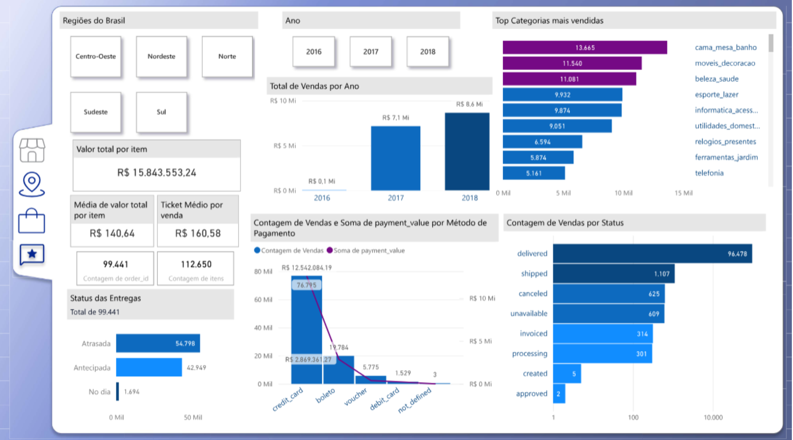

# 🛍️ Projeto Final – Análise de E-commerce Brasileiro (Olist)

Este projeto foi desenvolvido como conclusão da UFCD 10804 – Projeto de Business Intelligence, com o objetivo de aplicar práticas avançadas de modelagem de dados, análise exploratória e visualização estratégica de informações em ambiente Power BI. O estudo de caso foi baseado na base de dados da Olist, uma plataforma brasileira que conecta pequenos lojistas a grandes marketplaces, cujos dados estão disponíveis publicamente no Kaggle.

## 🎯 Objetivo
Construir um painel de Business Intelligence interativo que permitisse aos gestores da Olist acompanhar o desempenho de vendas, identificar gargalos logísticos e compreender o comportamento dos clientes ao longo da jornada de compra.

---

## 🧩 Estruturação do Projeto

### 1. Planeamento do Projeto

Iniciei o trabalho com um planejamento estruturado, definindo objetivos, prazos, entregas e recursos necessários. Essa etapa foi essencial para guiar todas as fases do projeto com clareza e foco.

### 2. Elaboração do Documento de Projeto

Elaborei um documento técnico contendo:
- **Escopo do Projeto**: definição dos limites e objetivos da análise;
- **Dicionário de Dados**: descrição dos campos, tabelas e relações no modelo de dados;
- **Protótipo Inicial**: criação de um wireframe de forma manual, antecipando o layout e os elementos visuais do painel no Power BI, para aceite da direção.

### 3. Modelagem e Análise de Dados

A análise prática começou com a importação dos arquivos CSV no Power BI. Modelei os dados com base em uma estrutura estrela, relacionando tabelas fato e dimensão. Em seguida, criei medidas DAX para compor os principais KPIs, incluindo:

- Receita Total
- Número de Pedidos
- Ticket Médio por Pedido
- Tempo Médio de Entrega
- Avaliação Média dos Clientes
- Receita por Categoria e Região

### 4. Criação do Dashboard e Design Visual

Construi o painel no Power BI focando na clareza e interatividade. Para enriquecer a apresentação, desenvolvi um fundo personalizado no **Figma**, integrando elementos visuais que reforçam a identidade da Olist e melhoram a experiência do usuário.

---

## 📈 Insights Obtidos

- Regiões e categorias com maior volume de vendas;
- Impacto do tempo de entrega na satisfação dos clientes;
- Análise de sazonalidade e evolução mensal das vendas;
- Comportamento de pagamento dos consumidores.

---

## 🛠️ Ferramentas Utilizadas

- Power BI Desktop  
- DAX  
- Excel  
- Figma  
- Kaggle  

🔗 [Base de dados – Kaggle: Olist Brazilian E-commerce](https://www.kaggle.com/datasets/olistbr/brazilian-ecommerce)

## 📊 Dashboard – Análise de Vendas da Olist

Dashboard interativo com filtros por região e ano, apresentando KPIs como receita total, ticket médio, quantidade de pedidos e itens vendidos. Gráficos exibem evolução anual de vendas, categorias mais vendidas, métodos de pagamento e status de entrega. O layout foi personalizado com design no Figma para melhor experiência visual.

